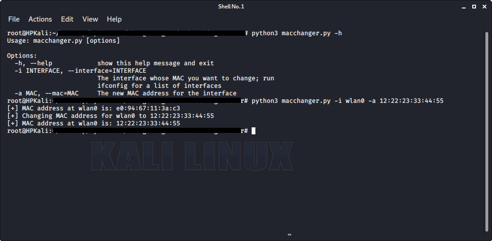

# MAC Changer
Change the MAC address on an interface
## Getting Started
Download the code and run it on Linux
> Python == 3.7
>
## Details
| File | Information |
|-------|------------|
| macchanger.py  | macchanger program to be run via the terminal | 
| venv  | python environment  | 

## Output
